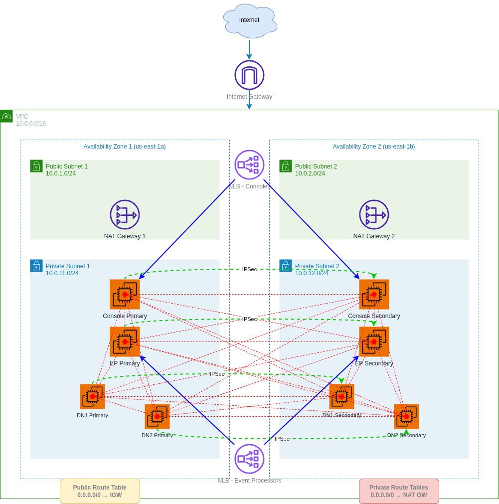

# AWS Cloud High Availability Network Architecture for QRadar

## Overview

This document describes the network architecture for a highly available QRadar deployment on AWS. The architecture combines AWS infrastructure with an overlay network solution to enable QRadar's High Availability (HA) features in a cloud environment. The design provides redundancy and fault tolerance across multiple Availability Zones (AZs).

### QRadar Deployment Architecture

This reference architecture supports a QRadar HA deployment consisting of:
- **Console Primary & Console Secondary**: QRadar management consoles in HA configuration
- **EP Primary & EP Secondary**: Event Processors in HA configuration
- **DN1 Primary & DN1 Secondary**: Data Node 1 in HA configuration
- **DN2 Primary & DN2 Secondary**: Data Node 2 in HA configuration

Each QRadar component is deployed as a pair across two availability zones, ensuring service continuity in the event of host or AZ failure.

## Architecture Diagram

See `network-architecture.drawio` for the visual representation of this architecture.

<picture>
  <source media="(prefers-color-scheme: dark)" srcset="network-architecture-dark.png">
  <source media="(prefers-color-scheme: light)" srcset="network-architecture-light.png">
  
</picture>

## Network Components

### 1. Virtual Private Cloud (VPC)

**CIDR Block:** `10.0.0.0/16`

The VPC provides an isolated virtual network environment in AWS. With a /16 CIDR block, this VPC can support up to 65,536 IP addresses, providing ample space for growth and subnet allocation.

**Key Features:**
- Logically isolated network environment
- Complete control over IP address range
- Customizable network configuration
- Support for both IPv4 and IPv6

### 2. Availability Zones

The architecture spans **two Availability Zones** to ensure high availability and fault tolerance:

- **Availability Zone 1** (e.g., us-east-1a)
- **Availability Zone 2** (e.g., us-east-1b)

**Benefits:**
- Protection against single AZ failures
- Improved application availability
- Reduced latency through geographic distribution
- Compliance with best practices for production workloads

### 3. Public Subnets

Two public subnets are deployed, one in each Availability Zone:

#### Public Subnet 1
- **CIDR Block:** `10.0.1.0/24`
- **Availability Zone:** AZ1 (us-east-1a)
- **Capacity:** 256 IP addresses (251 usable)
- **Purpose:** Hosts resources that need direct internet access

#### Public Subnet 2
- **CIDR Block:** `10.0.2.0/24`
- **Availability Zone:** AZ2 (us-east-1b)
- **Capacity:** 256 IP addresses (251 usable)
- **Purpose:** Hosts resources that need direct internet access

**Characteristics:**
- Direct route to Internet Gateway
- Resources can have public IP addresses
- Suitable for load balancers, bastion hosts, and NAT Gateways
- Network ACLs and Security Groups provide security controls

### 4. Private Subnets

Two private subnets are deployed, one in each Availability Zone:

#### Private Subnet 1
- **CIDR Block:** `10.0.11.0/24`
- **Availability Zone:** AZ1 (us-east-1a)
- **Capacity:** 256 IP addresses (251 usable)
- **Purpose:** Hosts application servers and databases

#### Private Subnet 2
- **CIDR Block:** `10.0.12.0/24`
- **Availability Zone:** AZ2 (us-east-1b)
- **Capacity:** 256 IP addresses (251 usable)
- **Purpose:** Hosts application servers and databases

**Characteristics:**
- No direct route to Internet Gateway
- Resources cannot have public IP addresses
- Internet access via NAT Gateway
- Enhanced security for backend resources
- Ideal for application servers, databases, and internal services

### 5. Internet Gateway (IGW)

**Purpose:** Enables communication between resources in the VPC and the internet.

**Key Functions:**
- Provides a target for internet-routable traffic
- Performs network address translation (NAT) for instances with public IP addresses
- Horizontally scaled, redundant, and highly available by design
- No bandwidth constraints

**Routing:**
- Attached to the VPC
- Public subnets route `0.0.0.0/0` traffic to the IGW
- Enables inbound and outbound internet connectivity for public subnet resources

### 6. NAT Gateways

Two NAT Gateways are deployed for high availability, one in each public subnet:

#### NAT Gateway 1
- **Location:** Public Subnet 1 (AZ1)
- **Purpose:** Provides internet access for Private Subnet 1

#### NAT Gateway 2
- **Location:** Public Subnet 2 (AZ2)
- **Purpose:** Provides internet access for Private Subnet 2

**Key Features:**
- Managed service (no maintenance required)
- Automatically scales up to 45 Gbps
- Provides source NAT for private subnet resources
- Requires an Elastic IP address
- Highly available within a single AZ

**Benefits of Multiple NAT Gateways:**
- Eliminates single point of failure
- Each private subnet has its own NAT Gateway in the same AZ
- Reduces cross-AZ data transfer costs

### 7. Network Load Balancers (NLB)

Two Network Load Balancers are deployed to provide high-performance, highly available access to QRadar components:

#### NLB for Console Access

**Deployment Configuration:**
- **Type:** Network Load Balancer (Layer 4)
- **Scheme:** Internet-facing
- **Subnets:** Spans both public subnets (AZ1 and AZ2)
- **Target Instances:** Console Primary and Console Secondary

**Target Group Configuration:**
- **Protocol:** TCP (HTTPS/443)
- **Health Check:** TCP or HTTP/HTTPS health checks on Console instances
- **Targets:**
  - Console Primary (Private Subnet 1)
  - Console Secondary (Private Subnet 2)
- **Stickiness:** Source IP-based session affinity (optional)

**Use Case:**
- Primary access point for QRadar administrators and analysts
- Web UI access for security operations
- API access for integrations and automation

#### NLB for Event Processor Access

**Deployment Configuration:**
- **Type:** Network Load Balancer (Layer 4)
- **Scheme:** Internal (private) or Internet-facing (configurable)
- **Subnets:** Can be deployed in public or private subnets based on requirements
- **Target Instances:** EP Primary and EP Secondary

**Target Group Configuration:**
- **Protocol:** TCP (Syslog/514, 1514) or UDP
- **Health Check:** TCP health checks on EP instances
- **Targets:**
  - EP Primary (Private Subnet 1)
  - EP Secondary (Private Subnet 2)
- **Connection Handling:** Optimized for high-volume log ingestion

**Use Case:**
- Load balancing for log and event ingestion
- Distributes syslog traffic across Event Processor instances
- Handles traffic from log sources (firewalls, servers, applications)
- Can be private for internal log sources or public for external sources

**Common NLB Features:**
- **High Performance:** Handles millions of requests per second with ultra-low latency
- **Static IP:** Provides stable endpoints for QRadar component access
- **Health Checks:** Continuously monitors instance health
- **Automatic Failover:** Routes traffic only to healthy instances
- **Cross-AZ Load Balancing:** Distributes traffic across both availability zones
- **Connection Draining:** Gracefully handles instance maintenance or failures
- **Preserve Source IP:** Maintains original client IP addresses for logging and security

**Benefits:**
- **Single Access Point:** Clients connect to one DNS name regardless of which instance is active
- **Automatic HA:** NLBs automatically route to healthy instances
- **Improved Availability:** Continues serving traffic even if one instance fails
- **Simplified DNS:** No need to update DNS records during failover
- **Load Distribution:** Evenly distributes traffic across available instances
- **Integration with Route 53:** Supports DNS-based routing and health checks

**Security:**
- Security groups restrict NLB access to authorized sources
- NLBs forward traffic to QRadar instances in private subnets
- QRadar instances remain isolated from direct internet access
- All traffic between NLBs and targets stays within the VPC
- Private NLB option for internal-only access

**Visualization in Diagram:**
- Two purple Network Load Balancer icons
- Upper NLB: Connected to Console Primary and Console Secondary
- Lower NLB: Connected to EP Primary and EP Secondary
- Blue arrows represent load balancing and health checking relationships

- Maintains internet connectivity if one AZ fails
### 8. QRadar EC2 Instances

Eight EC2 instances are deployed across the two private subnets to host the QRadar HA deployment:

#### Private Subnet 1 (Primary - AZ1)
- **Console Primary**: QRadar management console (primary)
- **EP Primary**: Event Processor (primary)
- **DN1 Primary**: Data Node 1 (primary)
- **DN2 Primary**: Data Node 2 (primary)

#### Private Subnet 2 (Secondary - AZ2)
- **Console Secondary**: QRadar management console (secondary)
- **EP Secondary**: Event Processor (secondary)
- **DN1 Secondary**: Data Node 1 (secondary)
- **DN2 Secondary**: Data Node 2 (secondary)

**Instance Configuration:**
- All instances are deployed in private subnets for enhanced security
- Each component has a primary instance in AZ1 and a secondary instance in AZ2
- Instances communicate via the overlay network for HA functionality
- Internet access provided through NAT Gateways for updates and external integrations

### 9. Overlay Network Architecture

#### Purpose and Requirements

QRadar's High Availability architecture requires Layer 2 network connectivity between HA pairs. However, AWS VPCs operate at Layer 3 and do not natively support Layer 2 protocols such as ARP (Address Resolution Protocol) across subnets or availability zones. 

To overcome this limitation, an overlay network is implemented using Linux network namespaces called "vrouter" on each EC2 instance. This overlay network creates a virtual Layer 2 network that spans across the AWS infrastructure, enabling QRadar's HA features to function properly in the cloud environment.

#### Vrouter Network Namespaces

Each of the eight QRadar EC2 instances contains a Linux network namespace named "vrouter" that participates in the overlay network:

**Vrouter Components:**
- Isolated network stack within each EC2 instance
- Dedicated virtual network interfaces
- Independent routing tables
- Layer 2 bridging capabilities

**Representation in Diagram:**
- Small red circles within each EC2 instance icon
- Indicates the presence of the vrouter namespace
- All vrouters are interconnected via tunnels

#### Overlay Network Tunnels

A full mesh tunnel topology connects all vrouter namespaces, ensuring any QRadar host can communicate with any other host at Layer 2:

**Tunnel Characteristics:**
- **Total Tunnels:** 28 tunnels forming a complete mesh
- **Protocol:** Encapsulated Layer 2 frames over Layer 3 infrastructure
- **Visualization:** Red dashed lines in the diagram
- **Connectivity:** Each vrouter has exactly one tunnel to every other vrouter

**Tunnel Matrix:**
- Console Primary ↔ 7 other vrouters (7 tunnels)
- Console Secondary ↔ 6 remaining vrouters (6 tunnels)
- EP Primary ↔ 5 remaining vrouters (5 tunnels)
- EP Secondary ↔ 4 remaining vrouters (4 tunnels)
- DN1 Primary ↔ 3 remaining vrouters (3 tunnels)
- DN2 Primary ↔ 2 remaining vrouters (2 tunnels)
- DN1 Secondary ↔ DN2 Secondary (1 tunnel)

**Benefits:**
- Enables Layer 2 protocols (ARP, broadcast, multicast) across subnets
- Allows QRadar HA to span availability zones
- Provides network-level redundancy with multiple paths

### 10. IPSec Tunnels for Data Protection

In addition to the overlay network tunnels, dedicated IPSec tunnels are established between each primary and secondary QRadar component pair:

**IPSec Connections:**
- Console Primary ↔ Console Secondary
- EP Primary ↔ EP Secondary
- DN1 Primary ↔ DN1 Secondary
- DN2 Primary ↔ DN2 Secondary

**Purpose:**
- Protect disk replication data as it traverses the cloud network
- Encrypt sensitive QRadar data in transit between HA pairs
- Ensure data confidentiality and integrity during replication
- Comply with security best practices for sensitive data

**Visualization:**
- Green curved dotted lines in the diagram
- Labeled "IPSec" to distinguish from overlay tunnels
- Connect corresponding primary and secondary instances

**Security Features:**
- Strong encryption algorithms (AES-256)
- Mutual authentication between endpoints
- Protection against man-in-the-middle attacks

## Routing Configuration

### Public Route Table

**Associated Subnets:** Public Subnet 1, Public Subnet 2

| Destination | Target | Purpose |
|-------------|--------|---------|
| 10.0.0.0/16 | local | VPC internal communication |
| 0.0.0.0/0 | igw-xxxxx | Internet access via Internet Gateway |

### Private Route Table 1

**Associated Subnets:** Private Subnet 1

| Destination | Target | Purpose |
|-------------|--------|---------|
| 10.0.0.0/16 | local | VPC internal communication |
| 0.0.0.0/0 | nat-xxxxx1 | Internet access via NAT Gateway 1 |

### Private Route Table 2

**Associated Subnets:** Private Subnet 2

### Log Source to Event Processor via NLB
1. Log Source (firewall, server, application) → Internet or VPN
2. Internet/VPN → Internet Gateway (if external) or Direct VPC access (if internal)
3. Traffic → Event Processor NLB
4. NLB Health Check → Determines active EP instance
5. NLB → Active EP Instance (Private Subnet)
6. EP processes and stores events

| Destination | Target | Purpose |
|-------------|--------|---------|
| 10.0.0.0/16 | local | VPC internal communication |
| 0.0.0.0/0 | nat-xxxxx2 | Internet access via NAT Gateway 2 |

## Traffic Flow Patterns

### Inbound Internet Traffic to Public Resources
1. Internet → Internet Gateway
2. Internet Gateway → Public Subnet (Load Balancer/Bastion)
3. Security Groups control access

### Outbound Internet Traffic from Public Resources
1. Public Subnet → Internet Gateway
2. Internet Gateway → Internet

### Outbound Internet Traffic from Private Resources
1. Private Subnet → NAT Gateway (in same AZ)
2. NAT Gateway → Internet Gateway
3. Internet Gateway → Internet

### Inter-Subnet Communication
1. Source Subnet → VPC Router (local route)
2. VPC Router → Destination Subnet
3. Network ACLs and Security Groups control access

### User Access to QRadar Console via NLB
1. User/Client → Internet
2. Internet → Internet Gateway
3. Internet Gateway → Network Load Balancer (Public Subnets)
4. NLB Health Check → Determines active Console instance
5. NLB → Active Console Instance (Private Subnet)
6. Console processes request and returns response via same path

### Inbound Traffic to QRadar Host
1. Source → EC2 Host
2. EC2 Host → Vrouter Namespace (local)
3. Vrouter Namespace → Virtual Ethernet
4. Virtual Ethernet → QRadar Host

### Outbound Traffic from QRadar Host
1. QRadar Host → Virtual Ethernet
2. Virtual Ethernet → Vrouter Namespace
3. Vrouter Namespace → EC2 Host (NAT'd)
4. EC2 Host → Destination

### QRadar HA Communication via Overlay Network
1. QRadar Host → Vrouter Namespace (local)
2. Vrouter Namespace → Overlay Tunnel → Remote Vrouter Namespace
3. Remote Vrouter Namespace → Remote QRadar Host
4. Layer 2 protocols (ARP, broadcasts) function transparently across AZs

### QRadar Disk Replication via IPSec
1. Primary QRadar Host → IPSec Tunnel → Secondary QRadar Host
2. Encrypted replication data traverses AWS network securely
3. Maintains data synchronization between HA pairs
4. Protects sensitive QRadar data in transit

## High Availability Design

### QRadar High Availability Architecture

This deployment combines AWS infrastructure resilience with QRadar's native HA capabilities to create a highly available SIEM solution:

**Key HA Features:**
- **Automatic Failover**: QRadar automatically detects host or component failures and promotes secondary instances to primary
- **Load Balancer Integration**: Network Load Balancer provides seamless access to Console instances with automatic health-based routing
- **Cross-AZ Resilience**: HA pairs span availability zones, protecting against entire AZ failures
- **Service Continuity**: The deployment can automatically resume service after the loss of one host or an entire availability zone
- **Zero Data Loss**: Continuous disk replication via IPSec tunnels ensures data consistency between primary and secondary instances
- **Layer 2 Overlay**: Vrouter namespaces enable QRadar's HA protocols to function across cloud subnets

**Failure Scenarios Handled:**
1. **Single Console Failure**: NLB detects failure via health checks and routes all traffic to healthy Console instance
2. **Single Host Failure**: Secondary instance in the other AZ takes over immediately; NLB continues routing to available instance
3. **Availability Zone Failure**: All secondary instances in the surviving AZ become primary; NLB routes to surviving AZ
4. **Network Partition**: Overlay network provides multiple paths for continued communication
5. **Component Failure**: Individual QRadar components (Console, EP, DN) fail over independently

**Recovery Characteristics:**
- **RTO (Recovery Time Objective)**: Minutes (automatic failover)
- **RPO (Recovery Point Objective)**: Near-zero (continuous replication)
- **Manual Intervention**: Not required for most failure scenarios
- **Service Degradation**: Minimal during failover events

### Multi-AZ Deployment

**AWS Infrastructure Benefits:**
- Resources distributed across two Availability Zones
- Protects against AZ-level failures (power, cooling, network)
- Enables zero-downtime maintenance
- Geographic separation within the same region

**QRadar HA Integration:**
- Primary instances in AZ1, Secondary instances in AZ2
- Overlay network enables HA communication across AZs
- IPSec tunnels protect replication data between AZs
- Combines AWS availability with QRadar HA for maximum resilience

### Redundant NAT Gateways
- One NAT Gateway per AZ
- Eliminates single point of failure for outbound internet connectivity
- Automatic failover within AZ
- Maintains internet access for updates and external integrations

### Network Redundancy

**Overlay Network Resilience:**
- Full mesh topology provides multiple communication paths
- Loss of individual tunnels does not impact overall connectivity
- Vrouter namespaces maintain Layer 2 connectivity across failures
- Automatic rerouting through alternate paths

**Subnet Isolation:**
- Public and private subnet separation
- Defense in depth security model
- Minimizes blast radius of security incidents
- QRadar hosts protected in private subnets

## Security Considerations

### Network Segmentation
- **Public Subnets:** DMZ for internet-facing resources
- **Private Subnets:** Protected environment for application logic and data

### Security Groups
- Stateful firewall at the instance level
- Control inbound and outbound traffic
- Support for security group chaining

### Network ACLs
- Stateless firewall at the subnet level
- Additional layer of security
- Can deny specific IP ranges or protocols

## Monitoring and Logging

### VPC Flow Logs
- Capture IP traffic information
- Store in CloudWatch Logs or S3
- Useful for security analysis and troubleshooting

### CloudWatch Metrics
- Monitor NAT Gateway metrics (bytes in/out, packets, connections)
- Track network interface metrics
- Set up alarms for anomalies

### AWS CloudTrail
- Log all API calls related to VPC resources
- Audit configuration changes
- Compliance and security analysis

## Disaster Recovery

### Multi-AZ Resilience
- Automatic failover between AZs for both AWS infrastructure and QRadar HA
- No manual intervention required for most failure scenarios
- RTO (Recovery Time Objective): Minutes (QRadar automatic failover)
- RPO (Recovery Point Objective): Near-zero (continuous disk replication)

### Backup Strategy
- Regular snapshots of EBS volumes for all QRadar instances
- QRadar configuration and data backups to S3
- Cross-region replication for critical QRadar data
- Automated backup schedules for disaster recovery

## Future Enhancements

### Potential Additions
1. **VPC Endpoints:** Direct access to AWS services without NAT Gateway (S3, CloudWatch)
2. **Transit Gateway:** Connect multiple VPCs for distributed QRadar deployments
3. **Additional QRadar Components:** Flow Collectors, App Host
4. **VPN or Direct Connect:** Hybrid cloud connectivity for on-premises log sources
5. **IPv6 Support:** Dual-stack configuration for modern network requirements
6. **AWS WAF:** Web application firewall for QRadar Console access

### Scaling Considerations
1. **Additional Data Nodes:** Scale storage and processing capacity
2. **Additional Event Processors:** Handle higher event ingestion rates
3. **Managed Hosts:** Add QRadar Collectors for distributed log collection

## Conclusion

This network architecture provides a comprehensive solution for deploying IBM QRadar SIEM in a highly available configuration on AWS. By combining AWS's multi-AZ infrastructure with an innovative overlay network approach, the architecture overcomes the inherent limitations of cloud networking to enable QRadar's Layer 2-dependent HA features.

**Key Achievements:**

1. **Layer 2 Connectivity in the Cloud**: The vrouter namespace overlay network successfully provides Layer 2 network functionality across AWS subnets and availability zones, enabling QRadar HA protocols to function as designed.

2. **True High Availability**: The deployment can automatically resume service after the loss of a single host or an entire availability zone, providing enterprise-grade resilience for critical security operations.

3. **Data Protection**: IPSec tunnels ensure that sensitive QRadar replication data remains encrypted as it traverses the AWS network, maintaining security and compliance requirements.

4. **AWS Best Practices**: The architecture follows AWS Well-Architected Framework principles with proper network segmentation, multi-AZ deployment, and defense-in-depth security.

5. **Scalability**: The design can be extended to support additional QRadar components, increased capacity, or multi-region deployments as organizational needs grow.

**Operational Benefits:**

- Minimal downtime during failures or maintenance
- Automatic failover without manual intervention
- Continuous data replication with near-zero data loss
- Enhanced security through network isolation and encryption

This reference architecture demonstrates that enterprise SIEM solutions like QRadar can be successfully deployed in cloud environments while maintaining the high availability and reliability required for security operations centers (SOCs) and compliance requirements.

## References

### AWS Documentation
- [AWS VPC Documentation](https://docs.aws.amazon.com/vpc/)
- [AWS Well-Architected Framework](https://aws.amazon.com/architecture/well-architected/)
- [VPC Best Practices](https://docs.aws.amazon.com/vpc/latest/userguide/vpc-security-best-practices.html)
- [NAT Gateway Documentation](https://docs.aws.amazon.com/vpc/latest/userguide/vpc-nat-gateway.html)
- [AWS Multi-AZ Deployments](https://docs.aws.amazon.com/whitepapers/latest/real-time-communication-on-aws/high-availability-and-scalability-on-aws.html)

### QRadar Documentation
- [IBM QRadar SIEM Documentation](https://www.ibm.com/docs/en/qradar-common)
- [QRadar High Availability Guide](https://www.ibm.com/docs/en/qradar-common?topic=qradar-high-availability)
- [QRadar Deployment Guide](https://www.ibm.com/docs/en/qradar-common?topic=qradar-deployment-planning)

### Network Technologies
- [Linux Network Namespaces](https://man7.org/linux/man-pages/man7/network_namespaces.7.html)
- [IPSec VPN Technology](https://datatracker.ietf.org/doc/html/rfc4301)
- [Layer 2 Overlay Networks](https://datatracker.ietf.org/doc/html/rfc7348)